# 🚀 K-Sport Hub
> 전국공공체육시설 통합 데이터 플랫폼

## 🎬 데모 영상 (Demo)

  <video src="test_video.mp4" width="100%" controls title="Service Test Video"></video>
  
▲ 서비스 실행 테스트 영상 (test_video.mp4)

## 🏗️ System Architecture

```mermaid
graph LR
    subgraph "External"
        API[공공데이터포털 API]
    end
    subgraph "Backend (Spring Boot)"
        Collector[Data Collector] --> DB[(MySQL)]
        DB --> RestAPI[REST API Server]
    end
    subgraph "Frontend (Next.js)"
        RestAPI --> UI[K-Sport Hub UI]
        UI --> User((User))
    end
```

## 🌟 사이트 특성
- **통합 검색**: 전국에 흩어진 공공체육시설 데이터를 지역/종목별로 한눈에 조회.
- **최적화된 렌더링**: Next.js의 SSR + CSR 하이브리드 전략을 통한 빠른 데이터 탐색.
- **반응형 디자인**: Tailwind CSS를 활용하여 모든 디바이스에 최적화된 UI 제공.

## ⚡ 성능 최적화
- **초기 로딩 속도 개선**: 메인 대시보드 데이터를 SSR로 사전 렌더링하여 사용자 체감 속도(LCP) 향상.
- **데이터 구조화**: 공공데이터 API 응답 형식을 DB에 정규화하여 저장함으로써 API 호출 비용 절감 및 조회 성능 최적화.

## 🛠 기술 스택 (Tech Stack)

### 💻 Backend
| Category | Stack |
| :--- | :--- |
| **Language** |  |
| **Framework** |  |
| **Database** |  |
| **Build Tool** |  |

### 🎨 Frontend
| Category | Stack |
| :--- | :--- |
| **Library** |  |
| **Styling** |  |

## 📌 주요 업데이트 사항
- 전국 공공체육시설 현황을 볼 수 있는 대시보드 Page 제작.
- SSR + CSR 하이브리드 렌더링으로 초기 로딩 속도 향상.
- 상세 기록은 [CHANGELOG.md](./CHANGELOG.md)에서 확인하실 수 있습니다.

## 📖 문서
- [프로젝트 데모 바로가기 (vercel)](https://kdt-mini-front.vercel.app/)
- [백엔드 Github 주소](https://github.com/scatch1228/KDT03_MINIPROJECT_BACK)